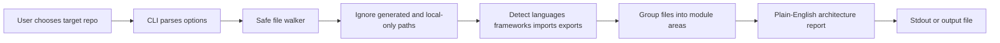

# Codebase Clarity

Codebase Clarity is a TypeScript CLI that explains a local codebase in plain English. Point it at a project directory and it writes a readable architecture report that covers the main languages, framework signals, module areas, notable files, imports, and exports.

It is meant to help people understand an unfamiliar repo before they edit it, review it, document it, or hand it to another maintainer.

## Who It Helps

- Developers joining a project who need a quick map of the code.
- Maintainers preparing a handoff, audit, or cleanup plan.
- Reviewers who want a neutral summary before reading a large diff.
- Technical leads comparing project structure across multiple repos.
- Non-specialist stakeholders who need a plain-English explanation of what a codebase contains.

## How It Works

Codebase Clarity does not execute the target project. It reads files from disk and summarizes signals that are usually available from source text and project metadata:

- It recursively walks the target directory.
- It skips common generated, dependency, cache, and local-agent folders such as `node_modules`, `dist`, `.git`, `.cache`, `.codex`, `AGENTS.md`, and `Obsidian`.
- It keeps relevant source, config, manifest, lockfile, and documentation files within the scan limits.
- It detects languages from file extensions and important filenames.
- It detects framework signals from config files, imports, and dependency names in `package.json`.
- It groups files into plain-English module areas from top-level folders and known project conventions.
- It renders a report to stdout or to a file.



## Setup

Requirements:

- Node.js 20.19 or newer.
- npm 11 or newer is recommended for the lockfile and audit commands used by this repo.

Install and build:

```bash
npm ci
npm run build
```

Run the built CLI against the current directory:

```bash
node dist/cli.js
```

Run it against another project and write the report to a file:

```bash
node dist/cli.js ../some-project --output architecture-report.txt
```

Limit scan size for large repos:

```bash
node dist/cli.js ./project --max-files 250 --max-file-size-kb 128
```

Show help and version:

```bash
node dist/cli.js --help
node dist/cli.js --version
```

## Commands

```bash
npm run lint
npm test
npm run build
npm run audit:moderate
npm run deps:outdated
npm run check
```

Command purpose:

- `npm run lint` checks TypeScript source and tests with ESLint.
- `npm test` runs the Vitest test suite.
- `npm run build` compiles `src` into `dist` and writes type declarations.
- `npm run audit:moderate` fails on moderate-or-higher npm advisories.
- `npm run deps:outdated` fails when npm reports outdated dependencies.
- `npm run check` runs lint, tests, build, audit, and outdated checks in one command.

## Environment And Config

The CLI is configured with command-line flags. It does not require secrets or external service credentials.

Use `.env.example` as a safe template for local shell wrappers or CI variables:

```dotenv
CODEBASE_CLARITY_TARGET=.
CODEBASE_CLARITY_OUTPUT=architecture-report.txt
CODEBASE_CLARITY_MAX_FILES=500
CODEBASE_CLARITY_MAX_FILE_SIZE_KB=256
```

These values mirror the CLI concepts:

- `CODEBASE_CLARITY_TARGET` is the directory to scan.
- `CODEBASE_CLARITY_OUTPUT` is an optional report file path.
- `CODEBASE_CLARITY_MAX_FILES` maps to `--max-files`.
- `CODEBASE_CLARITY_MAX_FILE_SIZE_KB` maps to `--max-file-size-kb`.

## Codebase Structure

```text
.
|-- .github/
|   |-- dependabot.yml
|   `-- workflows/ci.yml
|-- src/
|   |-- cli.ts
|   |-- index.ts
|   |-- report.ts
|   |-- scanner.ts
|   `-- types.ts
|-- tests/
|   |-- cli.test.ts
|   |-- report.test.ts
|   `-- scanner.test.ts
|-- .env.example
|-- eslint.config.js
|-- package.json
|-- README.md
|-- tsconfig.json
`-- vitest.config.ts
```

Important areas:

- `src/cli.ts` parses command-line flags, runs scans, and writes output.
- `src/scanner.ts` walks files, ignores generated paths, extracts imports and exports, and detects framework signals.
- `src/report.ts` turns scan data into a plain-English report.
- `src/types.ts` defines the scan and report data shapes.
- `tests/` covers CLI parsing, scanning behavior, and report rendering.
- `.github/workflows/ci.yml` runs dependency hygiene, linting, tests, and build checks.
- `.github/dependabot.yml` asks Dependabot to keep npm packages and GitHub Actions current.

## Security And Privacy

- Codebase Clarity scans local files only and does not send code to a network service.
- It does not execute the target project.
- It skips common generated folders, dependency folders, VCS metadata, and local-agent notes by default.
- Reports can include filenames, dependency names, imports, exports, and project structure. Review reports before sharing them publicly.
- Do not put secrets in `.env.example`, README examples, reports, test fixtures, or committed config.
- Keep private notes and machine-specific files out of version control.
