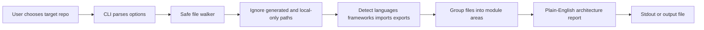

# Architecture

## How it works

Codebase Clarity does not execute the target project. It reads files from disk and summarizes signals that are usually available from source text and project metadata:

- It recursively walks the target directory.
- It skips common generated, dependency, cache and local agent folders such as `node_modules`, `dist`, `.git`, `.cache`, `.codex`, `AGENTS.md` and `Obsidian`.
- It keeps relevant source, config, manifest, lockfile and documentation files within the scan limits.
- It detects languages from file extensions and important filenames.
- It detects framework signals from config files, imports and dependency names in `package.json`.
- It groups files into plain-English module areas from top-level folders and known project conventions.
- It renders a report to stdout or to a file.

The diagram source is [architecture.mmd](architecture.mmd).

## Important areas

- `src/cli.ts` parses command-line flags, runs scans and writes output.
- `src/scanner.ts` walks files, ignores generated paths, extracts imports and exports, and detects framework signals.
- `src/report.ts` turns scan data into a plain-English report.
- `src/types.ts` defines the scan and report data shapes.
- `tests/` covers CLI parsing, scanning behavior and report rendering.
- `.github/workflows/ci.yml` runs dependency hygiene, linting, tests and build checks.
- `.github/dependabot.yml` asks Dependabot to keep npm packages and GitHub Actions current.
